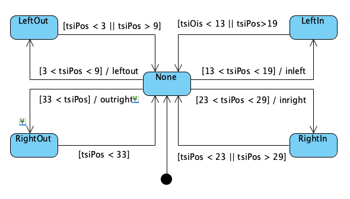

# Given code for Lab 7

Poll touch pad and write the distance and which softkey touched to the terminal. The softkey pad is used to change the brightness of RED and BLUE LEDs. 

Two threads are used.
 1. Thread to poll the touch pad distance and write the distance and softkey touched 
    (if distance is within an active softkey range) to the terminal
 2. Thread that controls the brightness of the blue and red LEDs based on which 
    softkey on the touchpad pressed. 

Used for touch thread: 
Created 4 soft keys on the touch pad using the following state transition logic

 

State Diagram for LedThread method that allows switching control between RED or BLUE LED: 

(Please download image)
